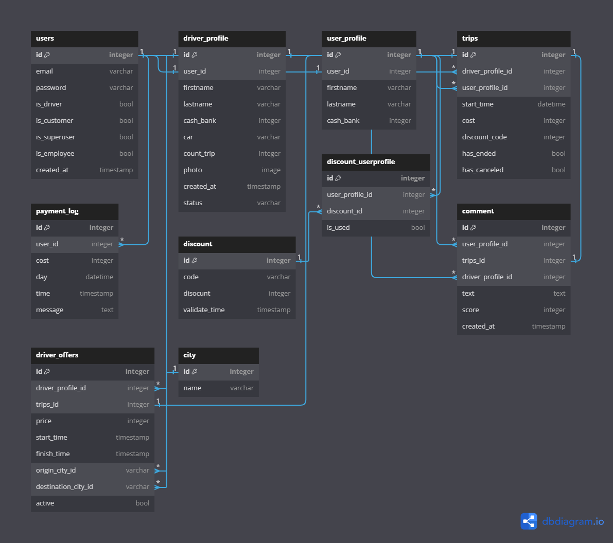

.png)
----------

**bitaxi** is open source RESTful api for ???

# Table of content

1. [What is this Api](#what-is-this-api)
2. [usage](#usage)
3. [features](#features)
4. [database design](#database-design)


## <a name="what-is-this-api">The api</a>
this api created to automate the proccess of traveling between cities of a country.<br>
the drivers after autorization and authentication can make offer for a origin to distination with specific price and time range.<br>
client in other hand can search trougth all these offers and accept the proper one.after a sucsesfull payment client can take the taxi and start the trip.<br>
at the end of trip a special code send to cliend and after client give the code to taxi driver , taxi drivers get their mony with 10% Commission.

## <a name="usage">Usage</a>
```
docker-compose -f docker-compose-dev.yaml up --build
```

## <a name="features">Features</a>
- 10 درصد مبلغ اعلام شده از سمت رضایی به اپلیکیشن به عنوان کارمزد پرداخت میشود.
- مسافرین می توانند به رضایی با ستاره و کامنت امتیاز بدهند . بعد از تایید مدریت نمایش داده میشود.
-  مسافرین می توانند ماشین مورد نظر خود را کرایه کنند.مثال: پراید و سمند به سمت تهران میروند .خانوم خردمندی ترجیه می دهد با سمند به سمت تهران بروند.
- پرداختی به راننده بعد از اتمام سفر و دادن کد اتمام سفر از سمت مسافر به راننده انجام میشود.
- پرداخت های تمام سفر های ان روز راننده در ساعت 12 شب یه حساب رانندگان بعداز کسر کارمزد ریخته میشود.
- نکته: برای مبلغ های بیشتر از یک میلیون تومان کارمزد 20 درصدی اعمال میشود
- کیف پول داخلی -> شارژ شدن از سمت سامانه
- نکته 2: سه سفر اول هر راننده بدون کارمزد میباشد.

## <a name="database-design">Database design</a>
after 4 years of programming,I can say this with confident that no databse design perfect unless they stay in payper!
<br>
so this database design (probably!) never go to the real world enviroment and therefore there is so much bugs and logical holes in this design.but i try my best to come with best and most bug free version of database design that 
make my life easyer!<br> 
and finally the design👇<br>

