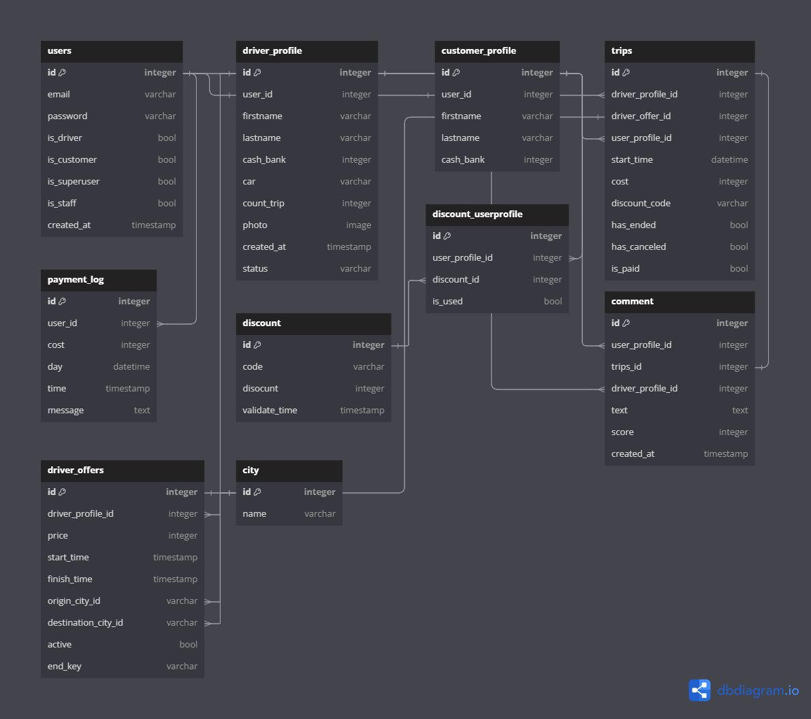

.png)
----------

**bitaxi** is open source RESTful api for traveling automation

# Table of content

1. [What is this Api](#what-is-this-api)
2. [usage](#usage)
3. [features](#features)
4. [database design](#database-design)


## <a name="what-is-this-api">The api</a>
This API is created to automate the process of traveling between cities within a country.<br>After authorization and authentication, drivers can make offers for trips from a specific origin to a destination with a specified price and time range.<br> Clients, on the other hand, can search through all these offers and accept the appropriate one.<br> After a successful payment, the client can take the taxi and start the trip.<br> At the end of the trip, a special code is sent to the client, and after the client provides the code to the taxi driver, the driver receives their payment with a 10% commission deducted.

## <a name="usage">Usage</a>
```
docker-compose -f docker-compose-dev.yaml up --build
```

## <a name="features">Features</a>


- 10% of the announced amount is paid to the application by the drivers. A 20% fee is applied for amounts greater than one million Tomans. The first three trips for each driver are free of charge.
- Travelers can rate drivers with stars and comments, which will be displayed after admin approval. Passengers can rent the car of their choice. For example, if Mr. Karimi prefers to travel to Tehran in a Samand instead of a Pride, he can make that selection.
- Payment to the driver is made after the completion of the trip and the passenger provides the completion code to the driver. Payments for all of the driver's trips for the day will be deposited into the driver's account at 12:00 PM after deducting the applicable fee.
- The internal wallet allows for charging from the system side, as well as top-ups and shopping. Discount codes can be created for various events.
- In the case of trip cancellation, 50% of the trip cost will be charged as a fine to the user.

## <a name="database-design">Database design</a>
After four years of programming, I can say with confidence that no database design is perfect unless it remains on paper.<br> Therefore, this database design will likely never reach a real-world environment and, consequently, contains many bugs and logical holes.<br> However, I have tried my best to come up with the best and most bug-free version of the database design to make my life easier.

And finally, here is the design:👇<br>

